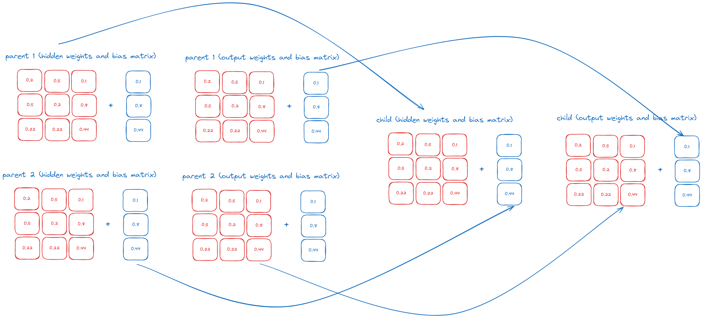

- This document has two versions (English and Portuguese). The Portuguese version is further below.
- Este documento tem duas versões (Inglês e Português). A versão em Português está mais abaixo.

 # Neat-template (English)

The genome class represents a candidate neural network. It keeps track of the weights, biases, and fitness score. The fitness score helps determine the best players of each generation. The higher the fitness score, the better the probability of being chosen as a parent.

```typescript
export abstract class Genome {
  protected fitnessScore: number;
  protected brain: NeuralNetwork;
}
```

The player class is where most of the code will be focused. If you were building a game like Flappy Bird, the player class would represent your bird. You can add anything you want to it, like a positioning vector, score, and so on.

The player class extends Genome, so you inherit all its functionalities. Inside the Player, it's mandatory to have an "evaluateFitness" method. But why not just have it implemented inside Genome? With this approach, it's easy to override the method, allowing anyone to have their own fitness function.

From the Player class, you can call the inherited method "predict" from the Genome class. This method receives a list of inputs (player velocity, position, etc.) and returns an output. We use the softmax activation function, which means the outputs will be a probability distribution adding up to 100%. You can interpret it however you want.

```typescript
import { Genome } from "./genome";
import { NeuralNetwork } from "./neuralNetwork";

export class Player extends Genome {
  private score: number;
  constructor(brain: NeuralNetwork) {
    super(brain);
    this.score = 0;
  }

  getScore(): number {
    return this.score;
  }

  evaluateFitness() {
    this.fitnessScore = this.score * this.score;
  }

  think(): void {
    const outputs = this.predict([Math.random(), 0.3, 0.3]);
    const maxIndex = outputs.indexOf(Math.max(...outputs));
    switch (maxIndex) {
      case 0:
        break;
      case 1:
        break;
      default:
    }
  }
}
```

Start by import the NEAT class and tensorflow. Set the tensor backend to "cpu", for simple scenaria there no need to use the GPU, and you will get better performance. If you are doing complex stuff, use the GPU.

# How to adapt NEAT in your code

```typescript
import { Neat } from "./neat/neat";
import * as tf from "@tensorflow/tfjs";

tf.setBackend("cpu");
```

Start by setting the population size, create a new instance of the Neat class, and pass the population size in the constructor.

Set the number of input, hidden and output nodes.

```typescript
const populationSize = 10;
const neat = new Neat(populationSize);

const inputNodes = 3;
const hiddenNodes = 2;
const outputNodes = 2;
```

Call the "initializePopulation" method, and pass the input, hidden and outputs nodes.

```typescript
neat.initializePopulation(inputNodes, hiddenNodes, outputNodes);
```

Call the evolve method from the NEAT, class. This method will only run when the population gets to zero.

```typescript
neat.evolveNextGeneration();
```

The "evolve" method takes care of parent selection, crossover, and mutation. To reset the population, call the "remove" method from NEAT. For example, in the Flappy Bird game, when the player hits a pipe, use the "remove" method from NEAT; it is essential for the algorithm to work.

When removing something from an array, make sure to loop through the array backwards.

```typescript
const population = neat.getPopulation();
for (let i = population.length - 1; i >= 0; i--) {
  const player = population[i];
  if (player.hit(pipe)) {
    neat.removePlayer(player);
  }
}
```

## Parent Selection

For this implementation, parent selection is done by choosing the two players with the best fitness scores.

## Crossover

Crossover is the process of taking the best players of their generation and merging their genes to generate the next one.

For this implementation, in crossover, we take the hidden weights of parent1 and the hidden bias of parent2 for the child's hidden weights and biases. Then we take the output weights of parent2 and the output bias of parent1 for the child's output weights and biases.



For the future, I intend to easily allow anyone to add a different crossover functionality by using the strategy design pattern.

## Mutation

For each player of the new generation, we loop through its weights (hidden, output weights, and biases), and there is a probability of it being mutated or not.

```typescript
if (Math.random() < this.mutationRate) {
  const offset = Math.random() * 2 - 1;
  mutableValues[k][j] = mutableValues[k][j] += offset;
}
```

```typescript
You can set the mutation rate by using the Neat class.
neat.setMutationRate(0.3)
```

## Neural Network

For our neural network, we use TensorFlow. In reality, we could implement our own neural network from scratch, as we only need the feedforward part. However, TensorFlow has lots of optimized functionalities that take into account performance. We can also use the GPU for more complex tasks.

## Next steps

- Ability to the save the model.
- Ability to load the model.
- Ability to customize the neural network more


# Neat-template (Português)

A classe Genome representa uma rede neural candidata. Ela acompanha os pesos, os vieses e a pontuação de fitness. A pontuação de fitness ajuda a determinar os melhores jogadores de cada geração. Quanto maior a pontuação de fitness, maior a probabilidade de ser escolhido como progenitor.

```typescript
export abstract class Genome {
  protected fitnessScore: number;
  protected brain: NeuralNetwork;
}
```

A classe Player é onde está focada a maior parte do código. Se estivesses a criar um jogo como Flappy Bird, a classe Player representaria o teu pássaro. Podes adicionar o que quiseres, como um vetor de posição, pontuação, entre outros.

A classe Player estende Genome, herdando assim todas as suas funcionalidades. Dentro de Player, é obrigatório ter um método "evaluateFitness". Mas por que não o implementar diretamente dentro de Genome? Com esta abordagem, é fácil substituir o método, permitindo que cada um tenha a sua própria função de fitness.

Na classe Player, podes chamar o método herdado "predict" da classe Genome. Este método recebe uma lista de inputs (velocidade do jogador, posição, etc.) e retorna um output. Usamos a função de ativação softmax, o que significa que os outputs serão uma distribuição de probabilidades somando 100%. Podes interpretá-los como quiseres.

```typescript
import { Genome } from "./genome";
import { NeuralNetwork } from "./neuralNetwork";

export class Player extends Genome {
  private score: number;
  constructor(brain: NeuralNetwork) {
    super(brain);
    this.score = 0;
  }

  getScore(): number {
    return this.score;
  }

  evaluateFitness() {
    this.fitnessScore = this.score * this.score;
  }

  think(): void {
    const outputs = this.predict([Math.random(), 0.3, 0.3]);
    const maxIndex = outputs.indexOf(Math.max(...outputs));
    switch (maxIndex) {
      case 0:
        break;
      case 1:
        break;
      default:
    }
  }
}
```

Começa por importar a classe NEAT e o TensorFlow. Define o backend do tensor como "cpu". Para cenários simples, não há necessidade de usar a GPU e obterás um melhor desempenho. Se estiveres a fazer algo mais complexo, então usa a GPU.

# Como adaptar NEAT ao teu código

```typescript
import { Neat } from "./neat/neat";
import * as tf from "@tensorflow/tfjs";

tf.setBackend("cpu");
```

Começa por definir o tamanho da população, cria uma nova instância da classe Neat e passa o tamanho da população no construtor.

Define o número de nós de entrada, ocultos e de saída.

```typescript
const populationSize = 10;
const neat = new Neat(populationSize);

const inputNodes = 3;
const hiddenNodes = 2;
const outputNodes = 2;
```

Chama o método "initializePopulation" e passa os nós de entrada, ocultos e de saída.

```typescript
neat.initializePopulation(inputNodes, hiddenNodes, outputNodes);
```

Chama o método "evolve" da classe NEAT. Este método só será executado quando a população chegar a zero.

```typescript
neat.evolveNextGeneration();
```

O método "evolve" trata da seleção de progenitores, crossover e mutação. Para reiniciar a população, chama o método "remove" da classe NEAT. Por exemplo, num jogo como Flappy Bird, quando um jogador bate num cano, usa o método "remove" da classe NEAT; isto é essencial para que o algoritmo funcione.

Ao remover algo de um array, certifica-te de que percorres o array de trás para a frente.

```typescript
const population = neat.getPopulation();
for (let i = population.length - 1; i >= 0; i--) {
  const player = population[i];
  if (player.hit(pipe)) {
    neat.removePlayer(player);
  }
}
```

## Seleção de Progenitores

Nesta implementação, a seleção dos progenitores é feita escolhendo os dois jogadores com as melhores pontuações de fitness.

## Crossover

Crossover é o processo de pegar nos melhores jogadores da sua geração e combinar os seus genes para gerar a próxima.

Nesta implementação, no crossover, pegamos nos pesos ocultos do progenitor1 e no viés oculto do progenitor2 para os pesos e viéses ocultos do filho. Depois, pegamos nos pesos de saída do progenitor2 e no viés de saída do progenitor1 para os pesos e viéses de saída do filho.


No futuro, pretendo permitir facilmente que qualquer um adicione uma funcionalidade diferente de crossover, usando o padrão de design strategy.

## Mutação

Para cada jogador da nova geração, percorremos os seus pesos (pesos ocultos, pesos de saída e viéses) e há uma probabilidade de sofrerem uma mutação ou não.

```typescript
if (Math.random() < this.mutationRate) {
  const offset = Math.random() * 2 - 1;
  mutableValues[k][j] = mutableValues[k][j] += offset;
}
```

```typescript
Podes definir a taxa de mutação usando a classe Neat.
neat.setMutationRate(0.3)
```

## Rede Neural

Para a nossa rede neural, usamos TensorFlow. Na realidade, poderíamos implementar a nossa própria rede neural do zero, pois só precisamos da parte de feedforward. No entanto, o TensorFlow tem muitas funcionalidades otimizadas que levam em conta o desempenho. Também podemos usar a GPU para tarefas mais complexas.

## Próximos passos

- Capacidade de guardar o modelo.
- Capacidade de carregar o modelo.
- Capacidade de personalizar mais a rede neural.


